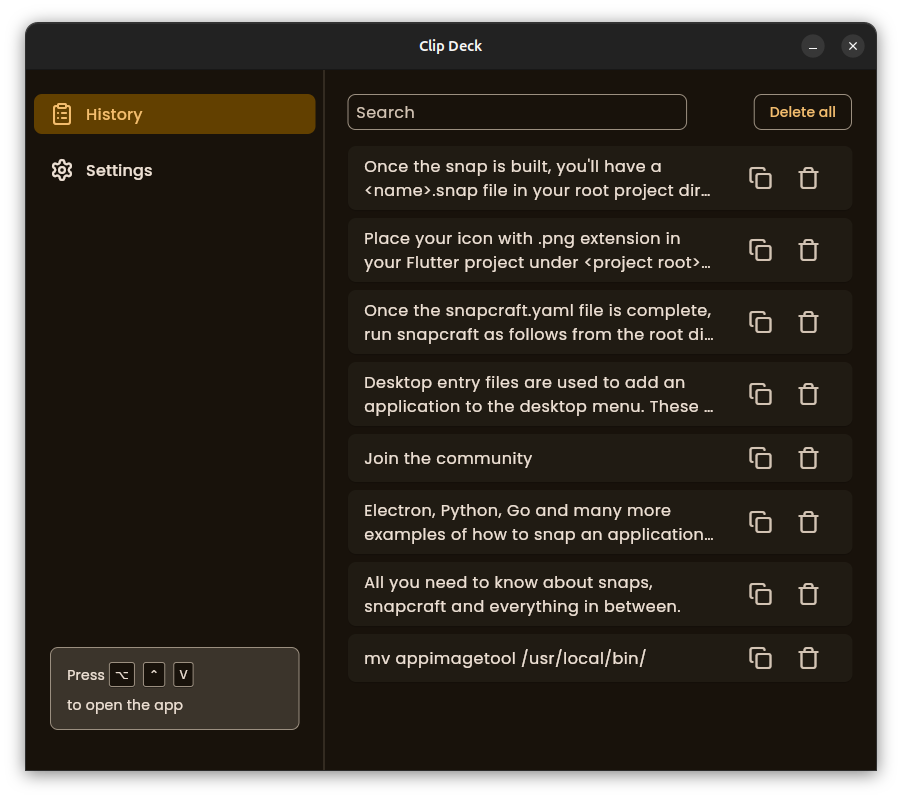
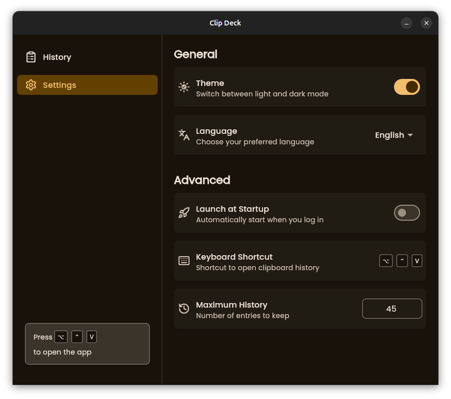

# Clip Deck

A clipboard management tool built with Flutter that helps you track, store, and quickly access your clipboard history.

## Features

- **Clipboard History Tracking**: Automatically captures and stores clipboard content (only text supported for now)
- **Global Hotkeys**: Quick access to clipboard items with customizable keyboard shortcuts
- **System Tray Integration**: Access your clipboard history from the system tray
- **Launch at Startup**: Option to automatically start with your operating system

## Screenshots





## Installation

### Requirements

- Flutter SDK
- Dart SDK
- **Linux Dependencies**:
  - `keybinder-3.0`: Required by the hotkey_manager package
  - `libayatana-appindicator3-dev`: Required by the tray_manager package
  - `libx11-dev libxtst-dev`: Required for simulating key press

### Linux Setup

Before running the application on Linux, install the required native dependencies:

#### For Debian/Ubuntu:
```bash
sudo apt-get update
sudo apt-get install keybinder-3.0 libayatana-appindicator3-dev libx11-dev libxtst-dev
```

### Application Setup

1. Clone the repository
   ```bash
   git clone https://github.com/KevinKarin06/clip_deck
   ```

2. Navigate to the project directory
   ```bash
   cd clip_deck
   ```

3. Install dependencies
   ```bash
   flutter pub get
   ```

4. Run the application
   ```bash
   flutter run
   ```

## Technologies Used

- **Flutter**: UI toolkit for building natively compiled applications
- **[clipboard_watcher](https://pub.dev/packages/clipboard_watcher)**: Monitors system clipboard changes
- **[hotkey_manager](https://pub.dev/packages/hotkey_manager)**: Registers global hotkeys 
- **[tray_manager](https://pub.dev/packages/tray_manager)**: Manages system tray icon and menu 
- **[window_manager](https://pub.dev/packages/window_manager)**: Controls application window behavior 
- **[launch_at_startup](https://pub.dev/packages/launch_at_startup)**: Configures application to launch on system startup
- **[easy_localization](https://pub.dev/packages/easy_localization)**: Handles application translations
- **[get_it](https://pub.dev/packages/get_it)**: Service locator for dependency injection
- **[keypress_simulator](https://pub.dev/packages/keypress_simulator)**: Simulates keyboard input 
- **[hive_ce_flutter](https://pub.dev/packages/hive_ce_flutter)**: Fast and lightweight local database
- **[provider](https://pub.dev/packages/provider)**: State management solution
- **[toastification](https://pub.dev/packages/toastification)**: Displays toast notifications

## Platform-Specific Setup

### Windows
- No additional setup required

### macOS
- N/A

### Linux
- Ensure the native dependencies mentioned above are installed
- Some desktop environments may require additional configuration for startup applications

## Troubleshooting

### Linux
- If hotkeys are not working, ensure `libkeybinder-3.0-dev or keybinder-3.0` is properly installed
- Some distributions may require additional steps to allow autostart functionality

### General
- If the application fails to start, check the terminal output for missing dependencies

## License

This project is licensed under the MIT License - see the LICENSE file for details.

## Acknowledgements

- Flutter team for their amazing framework
- All the package developers whose work made this project possible